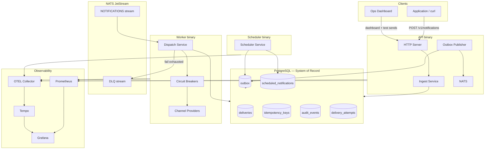

# Architecture Overview

[← Analysis index](README.md)

## High-level architecture diagram



## Major components and responsibilities

| Component | Binary | Responsibility |
|-----------|--------|----------------|
| **HTTP API** | `cmd/api` | Ingest, replay, dashboard reads, health, metrics; runs outbox publisher |
| **Outbox Publisher** | `cmd/api` (goroutine) | Polls `outbox` table, publishes to NATS, marks rows published |
| **Worker** | `cmd/worker` | NATS consumer, dispatch, retry, DLQ, circuit breaker |
| **Scheduler** | `cmd/scheduler` | Polls due scheduled notifications, enqueues outbox |
| **PostgreSQL** | — | Deliveries, idempotency, outbox, scheduling, audit, attempts |
| **NATS JetStream** | — | Durable work queue + DLQ streams |
| **Web dashboard** | Docker `web` | Ops UI (React, TanStack Query) for monitoring and test sends |
| **Observability stack** | Docker | OTEL Collector, Tempo, Prometheus, Grafana |

## Package layout (modular monolith)

```
internal/
  domain/          # Pure business rules (notification, routing)
  application/     # Use cases (ingest, dispatch, outbox, scheduler, replay)
  ports/           # Interfaces (repositories, broker, provider, clock)
  adapters/        # Infrastructure (postgres, nats, http, providers)
cmd/
  api/             # HTTP + outbox publisher
  worker/          # NATS consumer + dispatch
  scheduler/       # Scheduled notification processor
pkg/               # Shared utilities (retry, circuitbreaker, telemetry, apperrors)
```

## Data flow through the system

```
HTTP JSON → validate → idempotency check → [transaction: delivery + idempotency + outbox|scheduled + audit]
         → 202 + delivery_id
outbox poll → NATS publish (headers include traceparent, delivery_id)
         → worker consume → load delivery → status gate → provider.Send()
         → [success: succeeded + attempt + audit] | [retry: NAK + retrying] | [exhausted: dlq + dlq subject]
```

## External dependencies and integrations

| Dependency | Role | Failure mode handling |
|------------|------|---------------------|
| PostgreSQL 16 | System of record | API/worker cannot persist; health degraded |
| NATS JetStream 2.10 | Work queue | Outbox accumulates; republishes on recovery |
| Mock providers (MVP) | Channel dispatch | Simulated via recipient address patterns |
| OpenTelemetry Collector | Trace export | Traces dropped; metrics still via direct Prometheus scrape |
| Prometheus / Grafana | Metrics & dashboards | Observability degraded; core delivery continues |

## NATS subject routing

| Pattern | Example | Purpose |
|---------|---------|---------|
| `notifications.{channel}.{priority}` | `notifications.email.normal` | Work queue |
| `dlq.{channel}` | `dlq.email` | Dead letter stream |

Channels: `email`, `sms`, `push`, `webhook`. Priorities: `low`, `normal`, `high`.

---

**Next:** [Technology Choices](technology-choices.md) · [Workflows](workflows.md)
