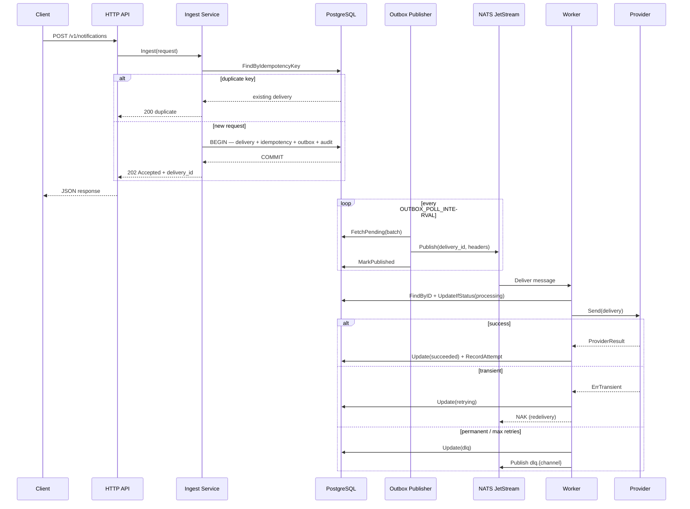
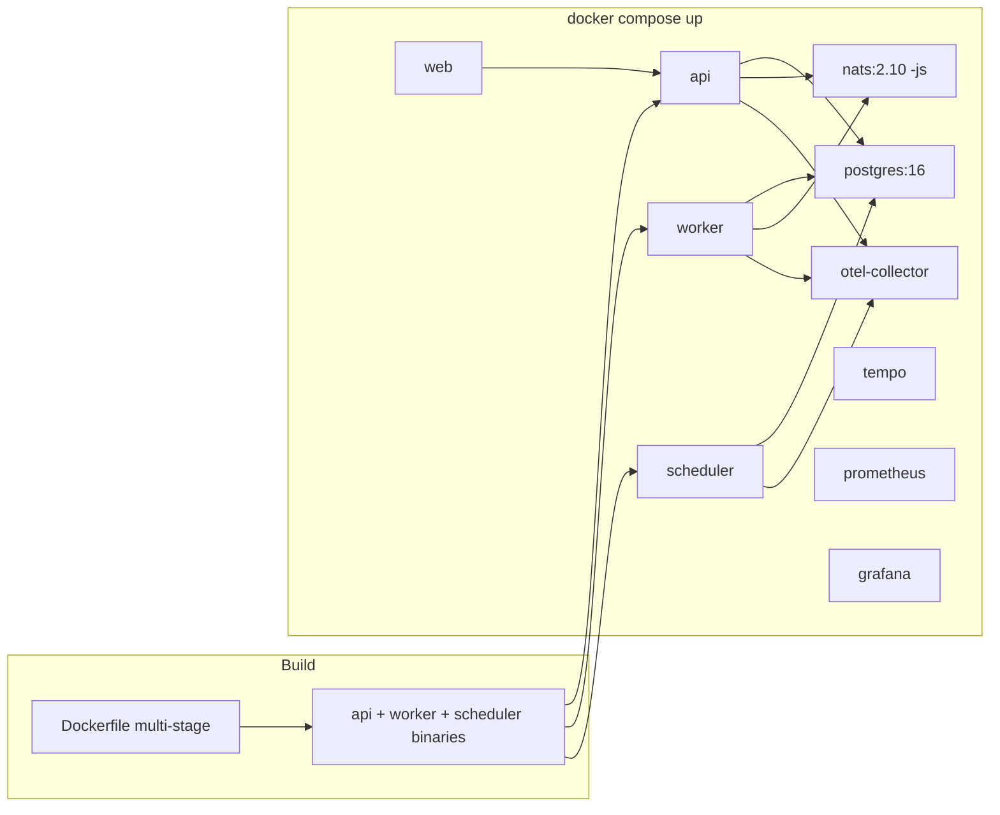

# System Workflows

[← Analysis index](README.md)

Major workflows step-by-step: request lifecycle, data processing, error handling, scaling, and deployment.

---

## User request lifecycle



### Steps in prose

1. Authenticate via `X-API-Key` (or Bearer token).
2. Decode and validate schema version, channel, priority, recipient, template/payload.
3. Fast-path duplicate check by idempotency key (avoids transaction on obvious dupes).
4. Transactional insert: delivery, idempotency registration, outbox OR scheduled row, audit event.
5. Return response immediately—dispatch is async.
6. Outbox publisher and worker complete the pipeline.

---

## Data processing lifecycle

**States:** `pending` → `queued` → `processing` → (`succeeded` | `retrying` → … | `dlq`)

| State | Meaning |
|-------|---------|
| `pending` | Accepted; scheduled for future or awaiting queue transition |
| `queued` | Ready for dispatch; message in or pending for NATS |
| `processing` | Worker owns the delivery |
| `retrying` | Transient failure; awaiting NATS redelivery |
| `succeeded` | Terminal success |
| `dlq` | Terminal failure; operator action required |

Scheduled notifications stay `pending` until the scheduler calls `Queue()` and inserts an outbox row.

Terminal states also include `failed`, `cancelled`, and `rejected` (defined in domain; not all paths exercised at MVP).

---

## Error handling flow

```mermaid
flowchart TD
    A[Provider.Send error] --> B{Permanent error?}
    B -->|yes| DLQ[Move to DLQ]
    B -->|no| C{Retry count >= max?}
    C -->|yes| DLQ
    C -->|no| D{Circuit breaker open?}
    D -->|yes| E[Treat as transient — NAK]
    D -->|no| F[Record attempt, mark retrying]
    F --> G[NATS NAK — redelivery after backoff]

    DLQ --> H[Publish to dlq.{channel}]
    DLQ --> I[Audit NotificationMovedToDLQ]
```

### Error classification (`pkg/apperrors`)

| Error | Behavior |
|-------|----------|
| `ErrTransient` | Retry via NATS NAK |
| `ErrPermanent` | Immediate DLQ |
| `ErrCircuitOpen` | Transient (fail fast while provider unhealthy) |

Mock provider triggers via recipient substring: `fail-transient`, `fail-permanent`, `fail-circuit`.

See [DLQ runbook](../runbooks/dlq-inspection.md) and [Replay runbook](../runbooks/replay.md).

---

## Scaling and performance flow

**Current model (MVP):**

- **API:** Single instance; horizontal scaling safe if outbox publishers coordinate (multiple publishers duplicate effort but `HasPublishedForDelivery` guards).
- **Worker:** `WORKER_CONCURRENCY` goroutines each with durable NATS consumer; scale by adding worker containers.
- **Scheduler:** Single poller; bottleneck for high scheduled volume.
- **PostgreSQL:** Connection pool per binary; primary write path for all state.
- **NATS:** Single node; throughput target 500 req/s sustained ingest ([SLO](../../tests/performance/SLO.md)).

**Backpressure signals:** `queue_depth` (pending outbox), `worker_active_jobs`, NATS consumer pending (approximate), API latency histograms.

---

## Deployment flow



**Startup order:** Postgres and NATS healthchecks pass → API ensures JetStream streams → outbox publisher starts → workers subscribe → scheduler polls.

**Graceful shutdown:** SIGTERM → context cancel → HTTP shutdown (10s timeout) → NATS consumer stop → telemetry flush.

Quick start: `cd deploy && docker compose up --build`

---

**Next:** [Engineering Concepts](engineering-concepts.md) · [Architecture](architecture.md)
